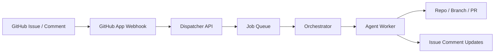

# Architecture

## Goal

Create a GitHub App that turns GitHub Issues into executable agent jobs.

## Core Components

### 1. GitHub App

Responsibilities:

- receive webhook events from GitHub
- authenticate as the app
- read issues, comments, labels, and repo metadata
- post comments, labels, and status updates

### 2. Dispatcher API

Responsibilities:

- normalize GitHub events into internal job payloads
- dedupe repeated triggers
- validate repo eligibility and allowed actions
- enqueue jobs for execution

### 3. Orchestrator

Responsibilities:

- select the right worker type
- prepare workspace and repo context
- pass prompt + repo + constraints to the worker
- collect result status, logs, and output artifacts

### 4. Worker Runtime

Possible workers:

- Codex
- Cursor-driven automation
- OpenHands
- internal ACP/Echelon worker

Responsibilities:

- inspect repo and issue
- execute allowed work
- commit changes
- open PR or comment back with findings

### 5. Persistence Layer

Stores:

- GitHub installation IDs
- repo-level configuration
- job records
- execution status
- linked issue/PR references

## Request Flow

1. User opens issue or comments on issue
2. GitHub App receives webhook
3. Dispatcher validates trigger
4. Dispatcher resolves repo config
5. Dispatcher creates job
6. Orchestrator runs worker
7. Worker updates issue and optionally creates PR
8. App marks completion with labels/comments

## Recommended V1 Boundaries

Include:

- issue opened
- issue labeled
- issue comment command
- comment back progress
- create PR linkback

Do not include yet:

- autonomous merge
- destructive production actions
- cross-repo chained workflows
- secret provisioning from GitHub requests

## System Diagram

